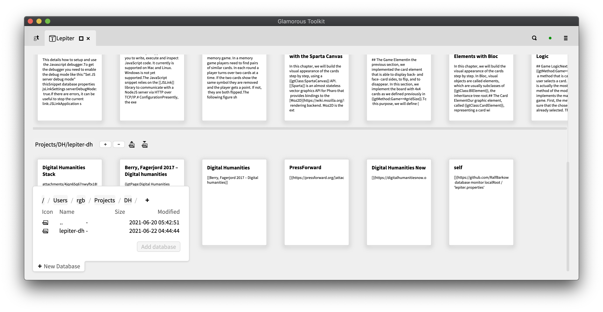

# lepiter-dh

Lepidus=glamorous, Iter=journey, dh=digital humanities

This will be the lecture notes for a planned course on the foundations of the Digital Humanities.
More precisely, it is a knowledge base – based on an engine called Glamorous Toolkit.

## Download the engine

You can obtain Glamorous Toolkit at https://gtoolkit.com/download/ in three ways: downloading a ready made distribution, cloning the code explicitly, or manually downloading the artifacts.

## Add database

In Glamorous Toolkit (gt for short)

